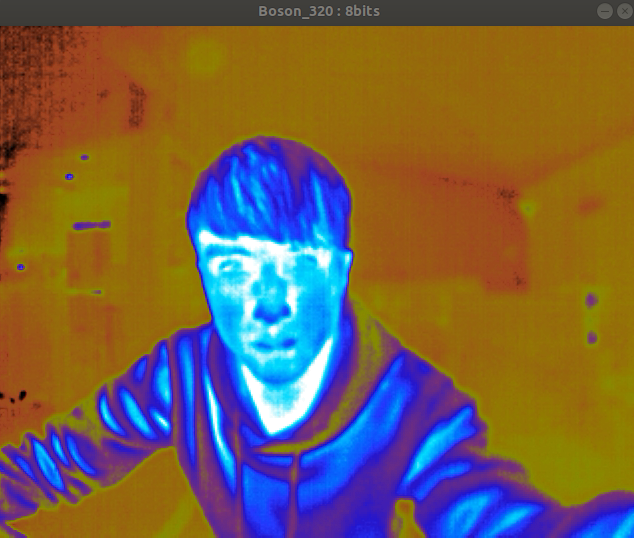
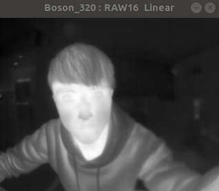

# thermal_sensor
Uses v4l2 to capture images from the FLIR camera. Processes the images with OpenCV and publishes them using cv_bridge.
```
Camera:Boson320
```
## Boson_USB
This is an example of capturing Boson Video (USB) using V4L2 (Video for Linux 2)
and OpenCV to display the video. Boson USB has two modes, AGC-8 bits and
RAW-16bits.
Video in 16 bits is not paintable so a linear transformation needs to happen
before displaying the image. We call this process AGC, and in this example we
use the most basic one (LINEAR). Then we use stardard call to paint in GREY.
Video is 8 bits is directly paintable, linear transformation happens inside the
 camera, not further actions need to happen in SW.
To Display Boson data we are using OpenCV to convert from YUV to RGB.

### Demo
```
BosonUSB_y -> 8bit (640*512)
```

```
BosonUSB_r -> 16bit (320*256)
```


## cali_thermal

## flir_boson_usb
ROS plugin for FLIR Boson Thermal camera.
### Demo
Thermal video in rviz  
  

Rostopic list  
 


## sync_img

