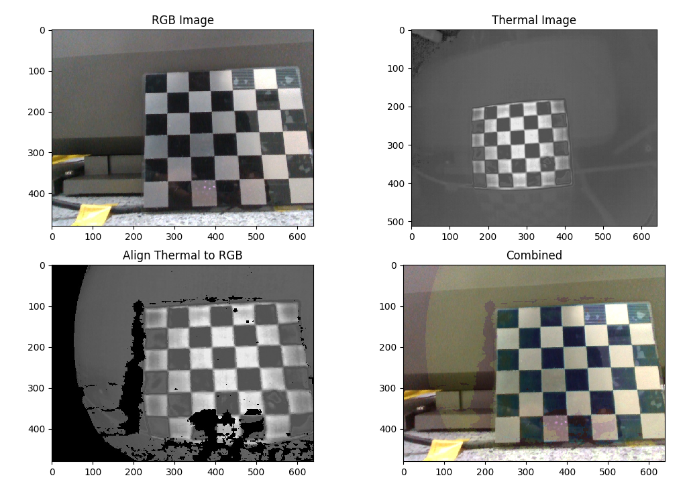
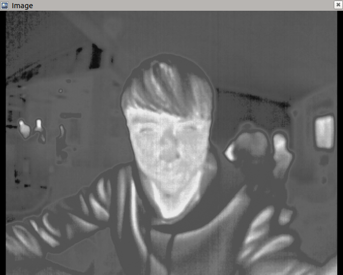
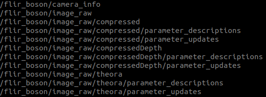

# thermal_sensor
Uses v4l2 to capture images from the FLIR camera. Processes the images with OpenCV and publishes them using cv_bridge.
```
Camera:Boson320
```

# Development Environment
- Ubuntu 18.04
- [ROS melodic](http://wiki.ros.org/melodic/Installation/Ubuntu)
- [Thermal calibration](https://github.com/sean85914/cali_thermal)

## Build
```
$ cd
$ git clone https://github.com/Alex1114/thermal_sensor
$ cd ~/thermal_sensor/catkin_ws
$ source /opt/ros/melodic/setup.bash
$ catkin_make
```
Note:
Do the following everytime as you open new terminals

```
$ cd ~/thermal_sensor
$ source environment.sh
```

## Boson_USB
This is an example of capturing Boson Video (USB) using V4L2 (Video for Linux 2)
and OpenCV to display the video. Boson USB has two modes, AGC-8 bits and
RAW-16bits.
Video in 16 bits is not paintable so a linear transformation needs to happen
before displaying the image. We call this process AGC, and in this example we
use the most basic one (LINEAR). Then we use stardard call to paint in GREY.
Video is 8 bits is directly paintable, linear transformation happens inside the
 camera, not further actions need to happen in SW.
To Display Boson data we are using OpenCV to convert from YUV to RGB.

### Demo
```
BosonUSB_y -> 8bit (640*512)
```

```
BosonUSB_r -> 16bit (320*256)
```


## cali_thermal
To register each pixel from the Thermal camera to the frame of the RGB camera,

### Demo
Result
 

## flir_boson_usb
ROS plugin for FLIR Boson Thermal camera and align to RGB.
```
$ roslaunch flir_boson_usb flir_boson.launch
```
After launch the RGB sensor, align thermal to RGB.
```
$ roslaunch flir_boson_usb align_thermal.launch
```
### Demo
Thermal video in rviz  
  

Rostopic list  
  

Align thermal to RGB
  

## sync_img
For someone need to record rosbag or collect data with thermal images and other sensor(RGBD images).  
This repo can synchronize the thermal and other sensor by the close timestam.

```
rosrun sync_img sync_img
```
