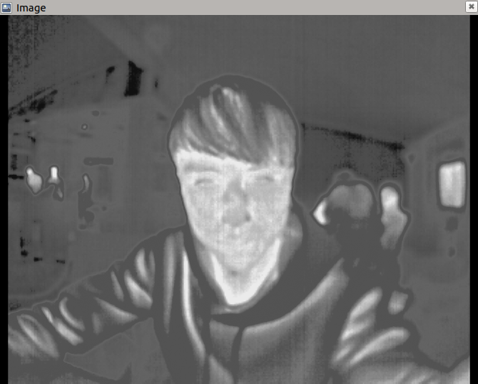
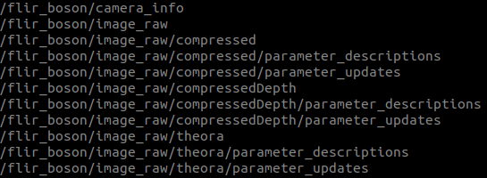

# flir_boson_usb 
ROS plugin for FLIR Boson Thermal camera
## Parameters
~frame_id
The tf frame to be used on all published images.

~dev
The path to the video device. Default is /dev/video0.  
**You have to checkout your camera port to ensure the data has been transmitted**

~frame_rate
The requested frame rate from the driver. The camera is only capable of 30 or 60 fps and this parameter does not currently modify the camera's configuration, only the rate at which frames are captured from the memory buffer. If a rate is requested which is above the current output frame rate of the camera, frames will only be produced by the driver at the camera's currently-configured rate. However, if a lower rate is requested, the frame production rate will be throttled to that rate.

~video_mode
The desired video mode for the images. Possible values are YUV and RAW16.  
**YUV is 640*512**  
**RAW16 is 320*256**

~zoom_enable
If using a Boson 640, this will enable the camera's zoom function which gives an image output of 640x480.

~sensor_type
The type of Boson camera being used. Possible values are Boson_320 or Boson_640.

~camera_info_url
The URL of a camera calibration yaml file which has been generated by the camera_calibration package. Used for image rectification.

## Demo
Thermal video in rviz  
  

Rostopic list  
  
