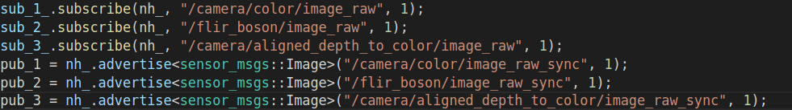

# sync_img
For someone need to record rosbag or collect data with thermal images and other sensor(RGBD images).  
This repo can synchronize the thermal and other sensor by the close timestam.

## RUN
```
rosrun sync_img sync_img
```

## topic
You can change the topic in sync.cpp and re-catkin_make to synchronize the sensor that you want.
 

## Demo
If the topic is correct, the terminal will print **synchronize successful**
 